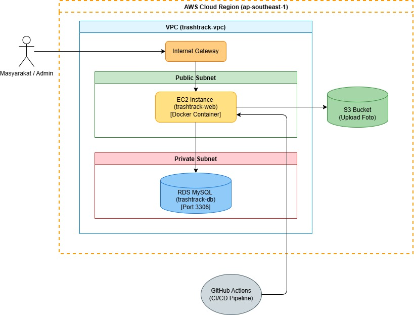

# ♻️ TrashTrack - Sistem Manajemen Persampahan


## 📖 Deskripsi Proyek
**TrashTrack** adalah sebuah Sistem Manajemen Persampahan berbasis web yang dirancang khusus untuk mewadahi pelaporan sampah liar. Aplikasi ini memfasilitasi dua kelompok pengguna utama:
- **Masyarakat (Pelapor):** Dapat melaporkan temuan sampah liar dengan menyertakan lokasi, deskripsi, dan foto bukti temuan.
- **Petugas / Admin Pemerintah:** Bertugas sebagai pengelola sistem yang memantau daftar pelaporan dan melakukan pembaruan status penanganan (seperti "Menunggu", "Dikerjakan", atau "Diangkut").

## 🏗️ Arsitektur Sistem



**Alur dan Komponen Arsitektur Cloud:**

Sistem ini di-deploy di atas infrastruktur Amazon Web Services (AWS) pada region `ap-southeast-1` (Singapura) dengan menerapkan prinsip keamanan dan skalabilitas tinggi. Berikut adalah rincian komponen arsitekturnya:

1. **Virtual Private Cloud (VPC) & Networking:**
   - Seluruh infrastruktur inti diisolasi di dalam sebuah VPC kustom (`trashtrack-vpc`) untuk memberikan kontrol penuh atas lingkungan jaringan virtual.
   - Menggunakan **Internet Gateway (IGW)** yang bertindak sebagai jembatan komunikasi antara jaringan VPC dengan internet global, memungkinkan pengguna mengakses aplikasi dari luar.
   - Jaringan dibagi menjadi dua lapisan: **Public Subnet** (untuk sumber daya yang menghadap ke publik) dan **Private Subnet** (untuk sumber daya backend yang sensitif).

2. **Compute & Containerization (EC2):**
   - Aplikasi Node.js dibungkus menggunakan **Docker** (Containerized) untuk menjamin konsistensi lingkungan dari tahap *development* hingga *production*.
   - Container ini dijalankan di atas server virtual **Amazon EC2** (`trashtrack-web`) berjenis `t3.micro` yang diletakkan di dalam *Public Subnet*. EC2 ini diekspos melalui Elastic IP/Public IP agar dapat diakses langsung oleh masyarakat dan admin.

3. **Database Management (RDS):**
   - Data tekstual relasional (seperti detail lokasi, deskripsi, dan status laporan) disimpan di dalam **Amazon RDS (Relational Database Service)** dengan *engine* MySQL.
   - Mengutamakan keamanan (Security by Design), *instance* RDS (`trashtrack-db`) ini secara strategis diletakkan di dalam **Private Subnet**. Database ini sama sekali tidak memiliki akses internet publik dan diatur oleh *Security Group* ketat yang hanya mengizinkan *inbound traffic* pada port 3306 dari server EC2.

4. **Object Storage (S3):**
   - Mengingat aplikasi ini mewajibkan pengguna untuk mengunggah foto bukti tumpukan sampah, penyimpanan file statis/media dipisahkan dari server utama.
   - Seluruh file gambar langsung diunggah dan disimpan ke **Amazon S3 Bucket**. Pendekatan ini secara drastis mengurangi beban penyimpanan di server EC2 dan memastikan foto dapat diakses/ditampilkan dengan cepat melalui *endpoint* publik yang diizinkan oleh *Bucket Policy*.

5. **Continuous Integration & Continuous Deployment (CI/CD):**
   - Otomatisasi proses *deployment* dikelola secara penuh oleh **GitHub Actions**. 
   - Setiap kali terjadi *push* atau pembaruan kode pada *branch* `main`, *pipeline* akan terpicu secara otomatis. GitHub terhubung ke instance EC2 melalui SSH (menggunakan kredensial yang diamankan di GitHub Secrets) untuk menarik kode terbaru, melakukan *build* ulang pada *image* Docker, dan me-*restart container* tanpa waktu henti (*downtime*) manual yang signifikan.

## 🚀 Stack Teknologi

| Kategori | Teknologi/Layanan |
|---|---|
| **Backend** | Node.js, Express.js |
| **Frontend** | EJS (Embedded JavaScript Templates), Bootstrap 5 |
| **Database** | MySQL (Disiapkan untuk AWS RDS) |
| **Cloud Provider** | Amazon Web Services (EC2, S3, RDS) |
| **Containerization** | Docker, Docker Compose |
| **CI/CD** | GitHub Actions |

## 💻 Panduan Instalasi Lokal

Ikuti petunjuk di bawah ini untuk menjalankan proyek TrashTrack di dalam sistem komputasi (server/komputer) lokal Anda:

1. **Clone repositori ini:**
   ```bash
   git clone https://github.com/bangaji313/trashtrack-cloud-app.git
   cd trashtrack-cloud-app
   ```
2. **Install dependensi:**
   ```bash
   npm install
   ```
3. **Konfigurasi Database Lokal:**
   - Buat sebuah database MySQL baru dengan nama `trashtrack`.
   - Jalankan keseluruhan perintah struktur SQL yang berada di dalam file `database.sql` ke dalam database yang baru dibuat tersebut.
4. **Setup Environment Variables (.env):**
   - Salin file `.env.example` ke file baru bernama `.env`:
     ```bash
     cp .env.example .env
     ```
   - Buka file `.env` di teks editor Anda dan isi nilai kredensial *(credentials)* yang sesuai baik itu koneksi MySQL (*Localhost/RDS*) maupun konfigurasi AWS S3 Bucket.
5. **Jalankan Aplikasi:**
   ```bash
   npm start
   # atau gunakan perintah berikut ini untuk mode development
   npm run dev
   ```
6. **Akses Aplikasi:** Buka browser dan arahkan alamat navigasi ke: `http://localhost:3000`

## 👨‍💻 Author
- **Nama:** Maulana Seno Aji Yudhantara
- **NRP:** 152022065
